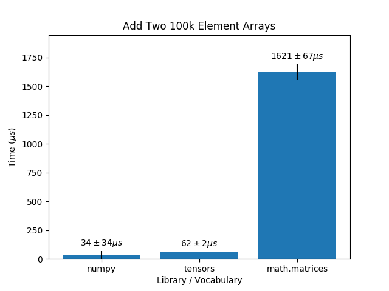

% Factor 2019-2020 Final Report

# About This Project

The goal of this project is to make non-trivial improvements to
Factor. There are many avenues for a concerted effort to grow Factor
in an organized and consistent manner. Any programming language can
benefit from this sort of effort, Factor included. After consulting
with the Factor maintainer [John](https://re-factor.blogspot.com/), we
narrowed down this open-ended goal to two projects: creating an online
platform for learning and using Factor and implementing a numerical
programming vocabulary in Factor.

This page provides summaries and methods for each project, as well as
possible areas for further development.

# The Factor Online Platform

Factor is a great programming language, but has yet to break into the
mainstream. We think that easing the learning process will help to
improve its rate of adoption. Our online platform targets three
aspects that could make the language more inviting to new programmers:
lowering the installation barrier, adding more tutorials and learning
materials, and creating a documentation search engine.


## The online Factor interpreter

Suppose you're a newcomer to Factor (maybe you are), looking to try
out Factor because you read on some blog post about the interesting
language/syntax features that Factor has, or simply because you wanted
to get a feel for what it was like to write Factor code.

In order to do that, you would first have to download and install
Factor on your computer—either from Factor's website, or by cloning
Factor's GitHub repository and compiling Factor from source.  To be
sure, doing so is not _difficult_—but for many users who are merely
looking to experiment with Factor, having to go through the entire
download/install process is enough to discourage them from trying
Factor.

The solution, inspired by existing tools for many other popular
languages (e.g., the Go Playground, Repl.it, JSFiddle, Try Haskell)
and various online coding course platforms (e.g., Codeacademy, Khan
Academy, freeCodeCamp), is a [_web-based interpreter_ for
Factor](https://factor.netlify.com).  A web-based Factor interpreter
removes the aforementioned accessibility barrier: to get started with
Factor, a user does not need to download or install anything—only
navigate to the Factor interpreter website (at
[factor.netlify.com](https://factor.netlify.com))—and they can start
exploring right away.

### Goals and design decisions

Factor, in its current form, is a self-hosted, compiled language.  In
other words, its compiler is written in Factor as well.  This form
doesn't lend itself well to being ported online for two reasons:
- first, the compiler outputs machine code (e.g., x86) meant for
  physical CPUs, not Javascript (or even WebAssembly), the language
  needed for web applications;
- second, in order to port the Factor compiler to Javascript, we would
  first have to port Factor to Javascript, since Factor's compiler is
  written in Factor.  These two reasons meant that we couldn't get
  away with something as simple as "use a X-to-Javascript transpiler
  that someone else wrote" to translate the Factor interpreter to
  Javascript; instead, we would have to understand the mechanics of
  Factor and write our own Factor interpreter—from scratch—in a
  web-friendly language (Javascript, or something that compiles to
  Javascript).

Given that requirement, we recognized it would not be realistic to
fully replicate the behavior of Factor within our one-school-year
timeline.  Thus, keeping in mind that the intent of this project was
to make Factor more beginner-friendly, we prioritized the following
goals:
- implement a core subset of Factor functionality, enough to
  demonstrate what "Factor is like";
- provide features that make it easy and fun to learn Factor (e.g.,
  helpful error messages, interactivity);
- supplement the interpreter with tutorials and
  documentation-searching tools (more in the Tutorials and Foogle
  sections), à la online coding course platforms.  Furthermore, we
  decided to implement the interpreter in [Elm](https://elm-lang.org/), a functional
  programming language for web applications known for its type safety
  (virtually no runtime errors!), performance, and work in
  user-friendly compilers and error messages.

### The implementation

As we mentioned in the previous section, our online Factor interpreter
is written in Elm.  This section will discuss, at a high level, the
architecture and the parts that fit together to make it work.  To get
into the finer details, you can find our source code [on
GitHub](https://github.com/factor-hmc/simple-interpreter).

#### The Elm architecture

If you're not familiar with the Elm architecture, it may be a good
idea to [read about that](https://guide.elm-lang.org/architecture/)
first (it's the same "architecture" that inspired the design of
React/Redux, Vue/Vuex, and many other modern Javascript web
frameworks).  The gist of the Elm architecture is this: the
entire application state (or "model"; this is stuff like the contents
of every text field, the data to be displayed, the currently focused
tab, etc.) is stored globally. Every time an event happens (e.g., a
button is clicked, the contents of a text field changes, an API call
returns a result), a "message" is emitted, and the model is updated
using an `update` function. This takes in a
message and the current model and returns the _next_ model, or how the
model should look after the message/event occurs.  Each
time the model is updated, a `view` function is
used to render the model to HTML.

#### The parts

The online interpreter platform comprises several sub-applications:
one for the actual interpreter interface (`Terminal.elm`), one for
loading tutorials (`Book.elm`), and one for interfacing with the
Foogle API (`Foogle.elm`).  Each sub-application lives in its own
Elm-architecture-like loop, with its own model, messages, and
`update` and `view` functions.  Occasionally, in order to have
different sub-applications interact with each other (e.g., clicking on
the `➦` arrow in a code block copies the code from the tutorials app
and pastes it in the interpreter app), messages from one
sub-application are passed to another sub-application; in this way,
the various sub-applications are tied together by the main, root-level
application module (`App.elm`).

In addition to the sub-applications, a separate collection of modules
(prefixed `Factor.*`) handle the definitions (`Lang.elm`), parsing
(`Parser.elm`), evaluation (`Runtime.elm`), and rendering (`Show.elm`)
of Factor code and are used by the interpreter interface to actually
run Factor code.  Since the Factor modules don't, strictly speaking,
constitute an "app", they aren't subjected to the
model-view-message-update Elm architecture.  However, they are
organized similarly:
- `Lang.elm` contains data type definitions amounting to Factor
  objects and syntax trees;
- `Runtime.elm` defines a Factor runtime model (type `State`, which
  stores information such as the current stack contents and a word
  definition lookup table) and implements how evaluating a piece of
  Factor code "updates" the state (function `evalWords`);
- `Show.elm` defines how different Factor values (numbers, strings,
  quotations) are rendered to text/HTML output.

### Future work & contributing

Below are a few areas in which the online Factor interpreter/platform
needs the most improvement, before the online interpreter can be truly
usable & useful for the general Factor community.

#### Compatibility with existing Factor mechanics

Currently, the web-based Factor interpreter is largely an
_approximation_ of how Factor actually works: the subset of Factor
that is supported in the web-interpreter is fairly narrow, and even
among that subset, behavior on the web-interpreter differs (sometimes
in subtle ways) from Factor's current behavior.  Here are a few
examples:

- **Tokenizing and parsing.** In many other languages, syntax for
  special constructs like function definitions and array literals are
  hard-coded into the language's grammar and parser.  On the other
  hand, Factor uses [parsing
  words](https://docs.factorcode.org/content/article-parsing-words.html)
  to handle most of its special syntax: word (function) definitions
  are processed by the parsing words
  [`:`](https://docs.factorcode.org/content/word-__colon__,syntax.html)
  and terminated by
  [`;`](https://docs.factorcode.org/content/word-%3B%2Csyntax.html),
  array literals by
  [`{`](https://docs.factorcode.org/content/word-%7B,syntax.html), and
  so on.  A key benefit of this approach is that it allows endless
  customization of Factor's syntax and the construction of various
  domain-specific languages (DSLs) in native Factor code.  To name a
  few examples:

  - [`pair-rocket`](https://docs.factorcode.org/content/vocab-pair-rocket.html)
    defines
    [`=>`](https://docs.factorcode.org/content/word-%3D__gt__%2Cpair-rocket.html),
    an alternative way to denote pairs in an "associative" container
    (e.g., a dictionary);
  - [EBNF](https://docs.factorcode.org/content/article-peg.ebnf.html)
    parsing words define a DSL that automatically synthesizes
    [PEG-parsers](https://en.wikipedia.org/wiki/Parsing_expression_grammar)
    from grammars expressed in
    [EBNF](https://en.wikipedia.org/wiki/Extended_Backus%E2%80%93Naur_form)
    syntax, reminiscent of parser-generator solutions such as `lex`
    and `yacc` for other languages;
  - [Hash
    tables](https://docs.factorcode.org/content/article-syntax-hashtables.html),
    [hash
    sets](https://docs.factorcode.org/content/article-hash-sets.html),
    [binary search
    trees](https://docs.factorcode.org/content/article-trees.html),
    and in fact _arbitrary_ containers/data structures may be
    constructed via custom-defined literal syntax words,
    e.g. [`H{`](https://docs.factorcode.org/content/word-H%7B,syntax.html),
    [`HS{`](https://docs.factorcode.org/content/word-HS%7B,syntax.html),
    [`TREE{`](https://docs.factorcode.org/content/word-TREE%7B,trees.html),
    etc.
    
  This limitless customization of Factor's syntax and parsing behavior
  is part of what makes Factor a uniquely flexible programming
  language.  So while working with parsing words aren't essential to a
  beginner's understanding _of_ Factor, they arguably _are_ essential
  to an authentic experience of what it is like to work with Factor.
  
  Currently, the web-based interpreter does not use parsing words.
  Instead, it takes the conventional approach and hard-codes a few
  special syntax words (`{` for array literals, `[` for quotation
  literals, `:` for word definitions, etc.) to deal with the most
  common use cases; a more authentic approach would be to replicate
  Factor's actual parser behavior, which may be summarized as follows:

  - Every Factor word is either an _ordinary word_ or a _parsing
    word_.  Ordinary words (e.g., `+`, `print`) are essentially
    non-syntax, callable, "function" words.  Parsing words (e.g. `V{`,
    `::`, `{`, `[`, `=>`), on the other hand, define custom parsing
    behavior, such as special constructs, container literals and DSLs.
    
  - During parsing, Factor keeps an _accumulator vector_, which stores
    a list of "instructions" (e.g., push the number `13` onto the
    stack; push a quotation on the stack; call the word `times` on the
    current stack contents).  The accumulator vector amounts to a
    mutable "syntax tree" for Factor code during parsing.
    
    Given a piece of Factor code, the parser first splits
    the code into tokens by whitespace (the "tokenize" step), then
    processes each token in order.  For each token: 

    - If the token is a literal string or number, a corresponding
      "push" instruction is added to the accumulator vector.  For
      instance, `12` adds a "push the number `12` onto the stack"
      instruction to the accumulator.
    - if the token is an ordinary word, a corresponding "call"
      instruction is added to the accumulator vector.  For instance,
      `+` adds a "call the function `+` on the current stack contents"
      instruction to the end of the accumulator.
    - _If the token is a parsing word_, it is _not_ added to the
      accumulator vector—instead, it is executed immediately, running
      special parsing primitives to parse code occurring after it and
      modifying the accumulator vector accordingly.  For instance, `{`
      interrupts normal Factor parsing, consumes tokens until a `}` is
      found, creates an array with elements initialized from the items
      it parses, and adds a "push this array onto the stack"
      instruction to the accumulator.
      
  You can read more about Factor's parsing mechanics and how parsing
  words work [in the official Factor
  documentation](https://docs.factorcode.org/content/article-parsing-words.html).
  
- **Name resolution and recursion**.  Currently, words are stored
  internally as lists of instructions (push, call, etc.).  A lookup
  table is used during evaluation to map word names to the
  corresponding instructions.  When a new word is defined in terms of
  existing words, we construct the instruction list for the new word
  by _concatenating_ the instruction lists of words used in the
  definition.  For example, if we define
  
  ```factor
  : addmul ( a b c -- d ) + * ;
  ```
  
  then the instruction list for `addmul` is constructed by
  concatenating the instruction list for `+` (obtained via the lookup
  table) with the instruction list for `*`.
  
  There are a few drawbacks to this approach, or at least the current
  implementation:

  - _It's inefficient._ Concatenating lists takes O(n) time
    (w.r.t. the length of the first list—Elm's `List` type is
    implemented internally as a singly-linked list, as in many
    functional languages of the same genre, e.g., Haskell and OCaml)
    and _doubles_ the memory used to store the definitions.  
    
    To illustrate the inefficiency, suppose a word `w` has instruction
    list [i1, i2, ..., in], and we define another word `x` as `w drop`
    (whose instruction list contains a single built-in `drop`
    instruction, since `drop` is a primitive); then `x` will
    instruction list [i1, i2, ..., in, drop].  Note that instructions
    `i1, ..., in` are stored _twice_, once in `w`, and once in `x`.

    The _sensible_ approach is to instead keep a "reference" to words
    used in the definition and call those references, rather than
    "copying" and concatenating the definitions.  A previous attempt
    at implementing this approach involved simply storing the names,
    as strings, of words, and looking up those names when the word is
    called, but that leads to erratic behavior, as in the following
    example:
    
    1. `w` is defined;
    2. `x` is defined in terms of `w`;
    3. `w` is redefined;
    4. when `x` is called, it _should_ use the original/old version of
       `w`, but because resolution happens at call-time, `x` now uses
       the new version of `w`.
       
    Concatenating instruction lists was a quick hack to avoiding the
    above behavior, but it is far from a good solution.  It should be
    noted, also, that the current implementation does not do this
    copy/concatenation recursively: _quotations_ defined in terms of
    existing words are stored using the names of those words, rather
    than concatenations of their instruction lists; this means that
    if, in the above example, the definition `x` uses a _quotation_
    containing `w`, and `w` is redefined, then when `x` is called
    still the new version is used.  So our current solution is really,
    in some sense, the worst of both worlds.
       
  - _Recursion is impossible (sometimes)._ It should be apparent that
    it is impossible to define a word directly in terms of itself
    (recursion from within a quotation is fine, since a quotation
    stores names rather than actual instruction lists), since if we
    were to try to define a word `w` in terms of itself, we would
    first try to find `w` in the table of existing words and
    concatenate `w` to itself—which would fail, since `w` is not yet
    defined!  Or, if `w` were previously defined, redefining `w` in
    terms of "itself" doesn't actually recursively call itself;
    instead, wherever a "recursive" call to `w` is made, the
    _previous_ version of `w` is used instead.
    
  A better way to handle word definitions is to combine lists "by
  reference".  One way to do so while allowing self-referencing
  (recursive) definitions is described below:
  
  - Define an `Instruction` type to be either a `Push` or `Call`
    variant: a `Push` variant denotes "push some item onto the stack",
    a `Call` variant denotes "call this word/instruction list on the
    stack".
    
    - The `Push` variant should hold a single parameter of type
      `Literal`, the object to push onto the stack;
      
    - The `Call` variant would hold a single parameter of type `List
      Instruction`, the instruction list to call on the stack.

      However, in this setup Elm's recursion system would prevent us
      from being able to define a self-referencing word such as `: a (
      -- ) 1 a ;` (yes, that example is one that has no practical use,
      but should still be theoretically possible to define), since
      traditional "tying the knot" methods for mutual/self-recursion
      are disallowed in Elm (read more about the problem
      [here](https://elm-lang.org/0.19.1/bad-recursion)).  The gist of
      the problem is that since `a` is defined in terms of itself, its
      instruction list must contain a `Call` variant holding, well,
      the instruction list itself.  Since Elm evaluates expressions
      strictly, a recursive definition like this would cause Elm to
      recur infinitely.
      
      The solution is to explicitly "lazify" the recursion: instead of
      parametrizing `Call` with a `List Instruction`, we parametrize
      it with _a function_ that lazily returns a `List Instruction`
      when called.  This allows us to apply a tie-the-knot technique
      without sending the Elm evaluator into an infinite recursive
      loop.
      
    The code below illustrates a simplified example of this idea in
    action:
      
    ```elm
    type Instruction 
      = Push Int
      | Call (() -> List Instruction)
      
    a : List Instruction
    a = let lazy () = [ Push 1, Call lazy ] in lazy ()
    ```
    
    compared to what the code _would_ look like if Elm supported
    recursive definitions with laziness by default. Note that this
    code _would not_ work in Elm:
    
    ```elm
    type Instruction
      = Push Int
      | Call (List Instruction)
      
    a : List Instruction
    a = [ Push 1, Call a ]
    ```
  
- **Word definitions.** Currently, word definitions on the web
  interpreter are evaluated at run time, i.e., when a definition
  instruction is executed.  In Factor, word definitions are evaluated
  at parse time.  To illustrate the difference, consider the following
  piece of code, wherein we define a word from within a quotation:
  
  ```factor
  [ : add1 ( n -- m ) 1 + ; ]
  5 add1
  ```
  
  In desktop Factor, `:` is executed as soon as it is encountered
  (since it is a parsing word), parsing and loading the definition
  `add1` immediately.  Thus an _empty_ quotation is pushed on to the
  stack (all tokens were consumed by the parsing process of `:`),
  `add1` is immediately defined and can be subsequently applied on `5`.
  
  On the current web interpreter, `:` is _not_ executed at parse time.
  Instead, it is parsed as a special "definition" instruction and
  stored in the quotation as though it were a special word.  Thus a
  quotation containing the "definition" instruction is pushed onto the
  stack, `add1` would not be defined, and the subsequent `5 add1` call
  would fail because `add1` is not defined.  One would have to `call`
  the quotation to actually define `add1`.
  
  Of course, it could be argued that this method allows for some
  interesting behavior as well, but it is confusing and certainly
  doesn't match the expected Factor behavior.  So it should be
  changed.  Presumably, fixing parsing (see the first bullet point)
  and adding parsing words would fix this issue as well.
  
- **Stack effects.** The current stack effect parser is incomplete: it
  can't handle any "nested" effects (e.g. `( quot: ( a -- b ) seq --
  seq' )` and doesn't parse any special tokens (e.g. `!` for
  mutability, `..` for row polymorphism).  It only accounts for
  space-delimited tokens separated by a `--`.  Furthermore, currently
  nothing useful is done with the stack effect—at a minimum, there
  should be some form of stack-checking/stack-inference used to verify
  word definitions.
  
- **Miscellaneous language features.** Various language features, such
  as classes, tuples, mixins, generics, etc. are not implemented.  The
  absence of these features prevents a significant portion of existing
  Factor code from working in the web interpreter.

#### Loading existing Factor vocabularies

Once Factor mechanics are replicated sufficiently in the web
interpreter per the above points, we will be able to properly load
existing Factor vocabularies (e.g., `combinators`, `sequences`,
`math`, etc.).  (Currently, only `kernel` and most of `math` are
available in the web-interpreter, and they were ported manually with
several dirty hacks, namely by pasting Factor code straight into Elm
and deleting code that used unsupported features.)  The proposed
method for doing so is as follows:

- Implement a parsing word `USE:`, which calls a primitive "load
  vocabulary" instruction from the Elm-based runtime.
  
- When the "load vocabulary" instruction is called, make an HTTP
  request to the official Factor GitHub repository to fetch the
  corresponding `.factor` source file (not having to keep a separate
  copy/version of the Factor source repository makes the interpreter
  easier to maintain; since the interpreter is meant as an
  experimental scratchpad anyway, version consistency & stability
  aren't that important anyway).  Parse the source file and load it in
  the interpreter runtime.

#### General UI and learner-friendly improvements

- The desktop Factor listener is highly interactive and introspective:
  most values are clickable and, when clicked, bring up dialogs
  presenting the contents/other details about the items clicked.  The
  web interpreter lacks this feature.

- We set out to make the web interpreter a low-barrier means for
  Factor newcomers to experiment with and learn Factor; key to this
  experience is helpful error reporting with user-friendly, intuitive
  error messages (see https://elm-lang.org/news/the-syntax-cliff,
  https://elm-lang.org/news/compilers-as-assistants,
  https://elm-lang.org/news/compiler-errors-for-humans).  Currently,
  the web interpreter has _no_ error reporting features.

- Syntax highlighting would be cool to have.


## Tutorials

When we began learning Factor, we started by following the ["Your First
Program"](https://docs.factorcode.org/content/article-first-program.html) tutorial within the Listener.  This tutorial taught us the
basics of Factor however, after we completed it we weren’t sure where
to go next.  There are a handful of beginner level resources that we found online. In fact, we cataloged many of these other resources an [“Other Resources”](https://factor.netlify.app/book/Resources.md) section.  We decided that creating more tutorials could only help entice new factor programmers.  We have a listing of all our tutorials in our ["Table of Contents"](https://factor.netlify.app/book/Table_of_Contents.md).

### Tutorial Structure

We decided to structure our tutorials into two categories.  The first
teaches basic ideas of Factor like how the Stack works or how to write
Words.  They also include an example that showcases the given idea in
action.  Our current set of tutorials that belong to this first set
are on the following topics:
 - [The Stack](https://factor.netlify.app/book/the-stack.md)
 - [Words](https://factor.netlify.app/book/words.md)
 - [Vocabularies](https://factor.netlify.app/book/vocabularies.md)
 - [Quotation and Combinators](https://factor.netlify.app/book/quotations_combinators.md)
 
The second set combines these basic ideas and
shows how one might approach coding a more complicated program.
We currently only have one tutorial for this set called ["Super Hello
World"](https://factor.netlify.app/book/Super_Hello_World.md) which walks through how someone might write a function which
prints something a certain number of times based on an input.  You can
see a short summary of each tutorial in the [Tutorial Summaries](tutorials.md) section 
of this report. We also have a ["Table of Contents"](https://factor.netlify.app/book/Table_of_Contents.md) section which gives
a short description of each tutorial so that users can easily find which
tutorial might be most beneficial to them.  We also have an ["Other Resources"](https://factor.netlify.app/book/Resources.md)
section which has a small collection of resources we consulted and found
helpful when learning Factor.

Our tutorials are being held on our Factor Online Platform along with
our interpreter and Foogle.  These two other aspects of the platform
help to make the tutorials more interactive.  When reading through the
tutorials, one can type sample code directly into the interpreter
to see what exactly each new line of Factor code introduced in the
tutorial does.  In addition, certain snippets of code allow the user
to click on it in order to have it copied into the interpreter.  This
way a user can see how exactly the piece of code should be written, as
well as quickly see what a snippet of code does if they do not want to
type it themselves.  We hope that the ease of running example code
helps sidestep some common beginner mistakes like missing spaces or
semicolons with little frustration. 

While Foogle does not directly interact with the tutorials, it is a great resource that can introduce new Factor programmers to the variety of vocabularies and words that they have access too.  Newer programmers can use Foogle to look up words mentioned in the tutorials to learn about them as well as similar words.  Foogle will also help facilitate the next step in learning Factor after finishing the tutorials.  Factor users that take the next step and attempt their own projects will be able to search for desired words faster.  The interpreter, tutorials, and Foogle all are able to help ease programmers into Factor.

### Tutorial Summaries  
We have a quick summary of each of the current the tutorials below:

#### [The Stack](https://factor.netlify.app/book/the-stack.md):
This tutorial explains the concept of the stack as well as how Factor Programming revolves around it.  We explain how one pushes and pops items from the stack and how a function applied to the stack will work.  We also give the user a collection of simple words which allow users to manipulate objects on the stack (dup, drop, swap … etc).
#### [Words](https://factor.netlify.app/book/words.md):
In this section, we explain that Factor’s version of functions are known as words.  We then go on to explain how to write and use words.  Specifically, we go into depth about how to specify the correct number of inputs and outputs a word will have and how words manipulate inputs to produce a desired output.  We also walkthrough the process of writing a word step by step.
#### [Vocabularies](https://factor.netlify.app/book/vocabularies.md):
Here, we explore vocabularies and how they are essentially Factor’s version of a library.  This tutorial shows how to import entire vocabularies or single words from vocabularies to use in projects.
#### [Quotations and Combinators](https://factor.netlify.app/book/quotations_combinators.md): 
This tutorial covers quotations and combinators.  It shows users how to push blocks of code to the stack, and how combinators can make use of them as inputs.  It then showcases quotations and combinators in action with a walkthrough that shows the creation of a word which outputs a certain term in the fibonacci sequence based on a given input.  We believe that this section should highlight quotations and combinators as important tools when developing complex programs.
#### [Super Hello World](https://factor.netlify.app/book/Super_Hello_World.md):
This tutorial is inspired by the Hello World tutorial that every programming language seems to have.  After learning how to write a program that prints “hello world”, we then learn how to write a more complicated program which prints “hello world” a specific number of times.  This section explores the thought process a Factor programmer might go through when writing code.  This tutorial also acts as a review of the previous sections.


### Future work

There are several aspects of our collection of tutorials that we would
like to improve.  The first is that we would like to create more
tutorials which expand on the basic ideas we have taught and write
more complicated programs like the Super Hello World tutorial.  We
think that showcasing the creation of more complicated projects will
not only show new Factor programmers how to approach building a larger
Factor program, but show off what Factor is capable of. For example, a tutorial which involves creating a simple vocabulary that contains several words or a tutorial demonstrating how to write a small “choose your own adventure” program that accepts inputs during runtime could be added.  There are even more advanced Factor topics for which it would be nice to have tutorials, like how to write unit tests or how to set up a class.

The second addition we would make is to ensure that every line of code
presented in the tutorial can be run in the interpreter.  As of right
now, most of the code in the tutorials can be run on the
interpreter.  However, there are still some Factor features which
are not implemented in the interpreter, meaning that
following the tutorials requires installing Factor.  One tutorial that suffers from this is the vocabularies tutorial.  The interpreter does not let a user run the ```USE:``` word to import any vocabularies.  In the Super Hello World tutorial,  we run into a similar problem when we try to create the word ``` : Super_HW ( n -- ) 1 swap [a,b] [ "Hello World" print . ] each ; ``` which requires the use of the word ```[a,b]``` from the `math.ranges` vocabulary and a combinator ```each``` which is from the sequences vocabulary.  It would make the learning experience much smoother
if this issues were fixed and we could type every line straight into the online interpreter.

Another thing we would like to incorporate into our tutorials is user
feedback.  Our tutorials have yet to be tested on new Factor learners.
We believe that giving these tutorials to new Factor programmers and
then receiving their feedback will allow us to target areas of the
tutorials that are lacking.  One way this could be carried out is to assemble a group of both experienced programmers and newer programmers.  We would then split them into two groups with an even mixture of veteran and novice programmers on each.  Give one group the tutorials from the Factor Online Platform and the other a list of tutorials found elsewhere online.  Allow both groups some time to experiment with the tutorials (maybe an hour).  Then give each group a short quiz that tests their ability to program in Factor as well as a short survey about what they liked and disliked about each tutorial.  This will allow us to see how effective our tutorials our compared to others.  It will also help identity problems with our tutorials.  We can also incorporate other aspects of other tutorials that users found helpful into our own.  A second way to get feedback would be to create a feedback form on the Factor Online Platform where users could suggest improvements on the tutorials and other aspects of the platform.


## Foogle

Suppose you’re writing a program in Factor and you have a list which you need to get the 7th element of. You don’t know how to do this in Factor, but you suspect there is a function that you can use. Foogle can find this function for you. You give it the query

```
( n:number seq:sequence -- elt )
```

and it gives you back a bunch of functions, among them `nth`, the function you’re looking for.

Foogle works by taking information about the inputs and outputs of a function. In this case, you’ve specified that your function’s first input (`n`) is a `number` and its second input (`seq`) is a `sequence`. You don’t know any specific information about its output, so you give it a name (`elt`) but don’t specify what type it has to be. Names are still important, since even if you don’t have type information about an input or output, if you have a sense of what its name might be, that will help Foogle find it. Using this information, Foogle finds functions in Factor that you might be looking for.

Try it at [https://factor.netlify.com/foogle](https://factor.netlify.com/foogle).


### Background and motivation

Have you ever implemented a function that you know must exist already? You just couldn’t find what library it was in and what that library called it. This is unsurprising. Even common operations like getting the first element of a list can have different names between programming languages: [first](https://docs.factorcode.org/content/word-first,sequences.html) in Factor, [head](https://hackage.haskell.org/package/base-4.12.0.0/docs/Data-List.html#v:head) in Haskell, or [car](https://www.gnu.org/software/emacs/manual/html_node/eintr/car-_0026-cdr.html) in Lisp.

Foogle is inspired by [Hoogle](https://hoogle.haskell.org/), a function search engine for Haskell. Hoogle allows users to query functions based on the types of their inputs and outputs. You might ask why this is relevant to Factor, seeing as it is not statically typed. Although Factor doesn’t require type annotations, parameters typically have some amount of type information associated with them. This either is documented in naming conventions, like `seq` for `sequence`s or `?` for `boolean`s, or in the help page for the function, like for [`+`](https://docs.factorcode.org/content/word-+,math.html) or [`nth`](https://docs.factorcode.org/content/word-nth%2Csequences.html). In general, there is some form of identifying information about the inputs and outputs of a function.

### Building, running, and deploying Foogle
Foogle depends on the Haskell package manager [stack](https://docs.haskellstack.org/en/stable/README/).

#### Building
To build, simply [install stack](https://docs.haskellstack.org/en/stable/install_and_upgrade/) and run

```
$ stack build
```

in the root.

#### Running
To run the server locally, set the port you want to host the server on (like 8001) as the environment variable PORT. For example, `$ export PORT=8001`. Then run

```
$ stack exec foogle-server
```

in the root. This will run the server at `http://localhost:8001` (or whatever port you set it). You may then query the server with `curl` to send GET requests.

You may also run the command-line interface locally, which is typically easier to test new features. After building (building builds both the server and application), run

```
$ stack exec foogle-exe -- [args] stack-effect
```

to query. To figure out what args the executable supports, run

```
$ stack exec foogle-exe -- -h
```

or

```
$ stack exec foogle-exe -- --help
```

If you want to run the interpreter and Foogle locally, follow the instructions on running the interpreter locally and change the `endpoint` variable in [`Foogle.elm`](https://github.com/factor-hmc/simple-interpreter/blob/master/src/Foogle.elm) to point to the localhost location (e.g. `http://localhost:8001`).
#### Deploying
Supposing that ownership of the Heroku app was transferred to you, it should be sufficient to connect your Heroku account and [push to the Heroku app via git](https://devcenter.heroku.com/articles/git). This will deploy the Foogle server on Heroku. The online platform points to the Heroku app when it queries Foogle, so you won't need to make changes there unless you change the URL at which Foogle is hosted.

If you do not have ownership of the Heroku app (and cannot obtain it), then you want to make a new one. Create it using [this buildpack](https://github.com/mfine/heroku-buildpack-stack) and make sure to configure the run file to build and run `foogle-server`. [This tutorial](https://hackernoon.com/for-all-the-world-to-see-deploying-haskell-with-heroku-7ea46f827ce) may be helpful in setting the app up. Then change the `endpoint` variable in `Foogle.elm`](https://github.com/factor-hmc/simple-interpreter/blob/master/src/Foogle.elm) to point to the new Heroku app.


### Implementation
There are three components to Foogle’s implementation and a fourth auxiliary interface.
1. Database generator
2. Search engine
3. Frontend
4. Command-line application

First, we generate a database containing input-output information for all of the functions in Factor. This database is read by the search engine. The frontend is used to send queries to the search engine, which returns them in a format that the frontend then displays to the user.

#### Database generator
You can find the database generator generator at [foogle/make-database.factor](https://github.com/factor-hmc/foogle/blob/master/make-database.factor).

The database generator is a simple script written in Factor that iterates over each function and creates a JSON object documenting it. These objects are described below.

##### Function objects

| Key              | Value Type        | Value Description                                                                       |
|------------------|-------------------|-----------------------------------------------------------------------------------------|
| "name"           | String            | Name of the function.                                                                   |
| "effect"         | Object or Boolean | If the function has a stack effect, an object representing it. Otherwise, the value `false`. |
| "url"            | String            | URL to the function's help page on the Factor documentation.                            |
| "vocabulary"     | String            | Name of the function's vocabulary (library).                                            |
| "vocabulary_url" | String            | URL to the vocabulary's help page on the Factor documentation.                          |

##### Stack effect objects

| Key                   | Value Type        | Value Description                                                                                                                                                                                                                             |
|-----------------------|-------------------|-----------------------------------------------------------------------------------------------------------------------------------------------------------------------------------------------------------------------------------------------|
| "in"                  | Array             | List of input stack effect variables                                                                                                                                                                                                                |
| "out"                 | Array             | List of output stack effect variables                                                                                                                                                                                                               |
| "in_var"              | String or Boolean | If the function has an input row variable, its name. Otherwise, the value `false`.                                                                                                                                                            |
| "out_var"             | String or Boolean | If the function has an output row variable, its name. Otherwise, the value `false`.                                                                                                                                                           |
| "terminated?"         | Boolean           | Does the function terminate in an error? Factor functions that do this usually have their output stack effect declared as `*`. See [this function](https://docs.factorcode.org/content/word-decode-error%2Cio.encodings.html) for an example. |
| "effect_descriptions" | Object            | An object that has keys equal to the names of the stack effect variables and values equal to their description on the function's help page. It may not have all stack effect variables in it (in fact, it may have none).                                                                                                   |

##### Effect variables
There are three possibilities for an effect variable’s value.

| Variable Type                   | Value Type | Value Description                                                                                                                              |
|---------------------------------|------------|------------------------------------------------------------------------------------------------------------------------------------------------|
| Stack Effect Variable           | String     | A string describing the name of the variable.                                                                                                  |
| Typed Stack Effect Variable     | Array      | An array of two strings. The first is the name of the variable and the second is the type of the variable.                                     |
| Quotation Stack Effect Variable | Array      | An array of a string and an object. The string is the name of the variable. The object is a stack effect object representing its stack effect. |

The generator creates a database of all functions that are in Factor when it is loaded (those obtained from the function `all-words`). This should be all of the functions in the official Factor ecosystem.

This database is an array of function objects. It is not too difficult to parse the database, but be aware that many values are heterogeneous (i.e. they can have more than one possible type). “in_var” for effect objects, for example, may be strings or the boolean value `false`.
#### Search engine

##### Overview

The search engine is a webserver written in Haskell using [Servant](https://www.servant.dev/). It first parses the database information. When it receives a query, it first parses the query into a stack effect, then searches functions to find those with stack effect closest to the query.

Parsing the database is not difficult, and follows the specification of the JSON values.

The query parsing closely mimicks Factor's own parser for stack effects. Tokens, for example, must be space-separated. A general description of the form of stack effects can be found [at this webpage](https://docs.factorcode.org/content/article-effects.html). There are a few differences for Foogle's parser. First, it is more permissive in what types of dashes it accepts as a separator between in variables and out variables (it will accept unicode em dashes, as searching on a phone can generate those by accident). Second, it allows users to search by types as if they were writing a stack effect declaration for a [TYPED: function](https://docs.factorcode.org/content/word-TYPED__colon__,typed.html). This syntax is of the form `effVarName: type`. It also allows users to specify _multiple_ types for a given variable by separating the type with a bar `|`. These are presently treated as a disjunction (i.e. only one of the types needs to match). Finally, it does not properly figure out whether an effect has the property `terminated?`. It's very likely that adding this property just requires that you check if the last effect variable in the output effect is called `*`, but this wasn't confirmed.

An example query showcasing most of the differing features of the parser is shown below. Comments are rendered after `!`, but this isn't valid syntax for the parser (although it could be extended to allow it).

```
( var1: boolean            ! declare types like in the TYPED: effect
  var2: string | sequence  ! declare disjunction types
  —                        ! em-dash instead of --
  *                        ! parsed as a normal stack effect, when it probably should change the terminated? property
)
```

Foogle conducts its searching using the metric of edit distance from one stack effect to another, where insertions and deletions are disincentivized. Effect variables with matching types have the most incentive to being matched. If the types cannot be matched, the engine attempts to match the names of the variables.

##### Code description

You can find the server code at [foogle/server](https://github.com/factor-hmc/foogle/tree/master/server). A summary of each file is provided below.

[foogle/server/Main.hs](https://github.com/factor-hmc/foogle/blob/master/server/Main.hs) compiles to the server executable. It loads the database and passes it to a function that makes and runs the server.

[foogle/server/Server.hs](https://github.com/factor-hmc/foogle/blob/master/server/Server.hs) is the actual server code. The type of the API (`QueryAPI`) specifies the inputs the server accepts and the outputs it returns. The `server` function implements the logic that validates inputs, calls a function to search the database, and returns an array of JSON objects (`FoogleResult`s). It uses [Servant](https://www.servant.dev/).

The main Foogle and searching logic is in
[foogle/src](https://github.com/factor-hmc/foogle/tree/master/src).

[foogle/src/Types.hs](https://github.com/factor-hmc/foogle/blob/master/src/Types.hs) contains the definitions of most types and their implemented type classes used by the search engine. Relevant type classes include the `Show` instances, which describe how to render the various data types, and the `FromJSON` instances, which describe how to parse the types from JSON. The JSON parsing uses [Aeson](https://hackage.haskell.org/package/aeson).

[foogle/src/EditDistance.hs](https://github.com/factor-hmc/foogle/blob/master/src/EditDistance.hs) is a (mostly copied) implementation of a dynamic-programming based edit distance algorithm.

[foogle/src/Parse.hs](https://github.com/factor-hmc/foogle/blob/master/src/Parse.hs) is a parser for stack effects. It supports some custom features that Factor doesn’t, like parsing multiple types for a stack effect variable as well as using unicode dashes instead of `--` to separate inputs and outputs (this is to help people searching on devices that make `--` into these unicode dashes). It uses [megaparsec](https://hackage.haskell.org/package/megaparsec) for parsing.

[foogle/src/Infer.hs](https://github.com/factor-hmc/foogle/blob/master/src/Infer.hs) is where the search engine guesses types for the stack effect variables. This is done by inspecting their names and documentation.

[foogle/src/Search.hs](https://github.com/factor-hmc/foogle/blob/master/src/Search.hs) is where the searching happens. Most of the code in this file is describing the various costs incurred or removed from matching of effect variables. The search itself is just taking the first `n` elements after lazily merge sorting by cost (the fact that the sort is lazy is important since it can make fewer passes over the database).

[foogle/src/Argparse.hs](https://github.com/factor-hmc/foogle/blob/master/src/Argparse.hs) is used for the command-line application.

#### Frontend
The frontend is a simple webpage written in Elm as part of the overall Factor Online Platform. It has rudimentary support for querying and rendering the server’s responses. It allows users to query by stack effect and specify the number of responses (up to 500, the server rejects requests for more in the interest of avoiding long response times).

You may find this page's source code at [simple-interpreter/src/Foogle.elm](https://github.com/factor-hmc/simple-interpreter/blob/master/src/Foogle.elm).

#### Command-line application
Foogle has a command-line application for offline use.

You can find the command-line code at
[foogle/app](https://github.com/factor-hmc/foogle/blob/master/app).

[foogle/app/Main.hs](https://github.com/factor-hmc/foogle/blob/master/app/Main.hs) parses the arguments and then runs them through the search engine, reporting the outputs. This executable dispatches to the same modules that the server uses, as well as `Argparse.hs`.

[foogle/src/Argparse.hs](https://github.com/factor-hmc/foogle/blob/master/src/Argparse.hs) describes how to parse the command line arguments. It uses [optparse-applicative](https://hackage.haskell.org/package/optparse-applicative).


### Future work
Although Foogle works, there is much room for improvement. Of its three parts, the database generator is the most fully-featured. The most-desired improvements lie in the search engine. There are a few open design questions for searching, as well as potential efficiency issues for larger queries.

#### Database generator
The database generator, though a rudimentary script, does generate quite a bit of information for each function. There is more information that could be gleaned if you wanted to run more in-depth analyses of each function. For example, you could do natural language processing on the entire help page to get a better sense of what types or values might inhabit each stack effect variable in a function. Or you could run some sort of profiling that collects information on what the common types each stack effect variable in a function takes on. These would be rather involved with unclear benefits, so it is recommended that you first focus on improving the search engine or frontend.

Any modification to the database generator would likely start with [foogle/make-database.factor](https://github.com/factor-hmc/foogle/blob/master/make-database.factor).
#### Search engine
The search engine is where the most improvement can happen. Searching presently is very brittle to reordering of parameters. Right now the searching is a modification of an edit distance algorithm, which requires the order to match. But you don’t always know the exact order of the input and output effects. One way of fixing this could be to do a bunch of searches with permuted orders and pick the best matching results from all of those searches. Factor functions don’t tend to have many arguments, but this would still very likely slow down the search speed, if not make searching intractably slow. So allowing reordering of parameters would possibly require a change to how the search is conducted. It would be worth trying the easy and quick fix (search permutations) and then attempting an overhaul if that is too slow.

Searching relies sometimes on matching the names of parameters, especially for parameters without any type information. For example, if you were looking for `nth` but you had no clue what the _names_ of any of the stack effect variables could be, your query might look like `( foo: number bar: sequence -- baz )`. This returns a lot of extraneous results, although `nth` is in there somewhere. If you had even specified one or two appropriate names like “seq” instead of “sequence”, the search brings `nth` closer to the beginning. This isn’t an awful thing, but something to be aware of. Relying as little as possible on name matching is ideal, but it is unclear what the best direction is to avoid. 

There is also more that can be done in terms of specifying the query: it would be nice to enable users to choose whether they’d like to search the names of functions, the stack effects, other features, or some combination. Hoogle also offers the ability to narrow the search to a certain set of packages, and that would be helpful for Factor too (two sets that would be easy to generate would be `core` and `extras`, of course it could also allow for user-specified sets). Since the database tracks the vocabulary where the functions come from, filtering by package shouldn’t be too difficult.

Add support to the parser for terminating effects (those which throw an error). This requires some research to be done on exactly how terminating effects are declared (we think it's stack effects whose last output effect variable is called `*`, but we're not sure) and then a modification to the parser in [foogle/src/Parse.hs](https://github.com/factor-hmc/foogle/blob/master/src/Parse.hs).

Once terminating effects are done, both row variables and terminating effects can be searched for in the search engine. They are presently ignored by the search engine, but represented in the data types of stack effects. For terminating effects, the check is just as simple as identifying whether `effTerminated` matches for the two effects. For row variables, you can check if both effects have them and assign a negative cost if so, reducing the cost further if the row variables match in name. A similar negative cost can be generated if both effects don't have row variables. This will incentivize proper matches between effects.

One interesting possibility for extending the querying is to add support for both disjunctions and conjunctions of types. Right now you can specify that a stack effect variable might be one of many types by using `|` (e.g. `var: string | boolean` indicates the variable can be either a `string` or a `sequence`). It might be useful to add an `&` that specifies that the variable _must_ be one of a type (e.g. `var: string & sequence` would indicate the variable has to match `string` and `sequence`), as well as support combinations of `&` and `|` such as `var: string & sequence | boolean` (where `&` has higher precedence). The utility would be that, though Factor can't expression concepts like "sequences of strings," you might be able to fake it by matching a variable which we guessed was a string or a sequence. You can start adding other boolean expressions too -- although I'm not sure at which point it starts to become superfluous. This would require changes just to the parser in [foogle/src/Parse.hs](https://github.com/factor-hmc/foogle/blob/master/src/Parse.hs) as well as work in [foogle/src/Search.hs](https://github.com/factor-hmc/foogle/blob/master/src/Search.hs).

The search is also not optimized for efficiency. The query is compared to every function in Factor and the top few are returned. This is done by using a lazy merge sort. Presumably, some form of keying based on stack effect (even by relative size or complexity) would allow us to narrow down the results and make more performant queries. Searching at least isn’t on the order of minutes, but it is far from instant, sometimes taking a few seconds. This isn’t a problem now, when there are only a few users, but may be an issue in the future. Efficiency may be increased by changing the output type of the database.

Any modification to the search logic would happen in [foogle/src](https://github.com/factor-hmc/foogle/tree/master/src) and would likely start with [foogle/src/Search.hs](https://github.com/factor-hmc/foogle/blob/master/src/Search.hs).
#### Frontend
There is also a lot that can be done for the frontend in terms of usability. The current design for the frontend was created quickly to just render the search results. A complete overhaul would not be unreasonable. Some potential directions for changes or improvements are listed below.

Right now users have to search by typing in a well-formed stack effect query. One possible change would be to use a graphical interface to specify what the inputs and outputs are, as well as their possible types. Each stack effect variable would be an element in the GUI that could be added or removed. Users would be able to specify the possible name of each element, as well as a list of its possible types.

It would be nice to be able to have each search result have a button that, when clicked, causes the result to expand and show more information about the function (e.g. the documentation).

It would be nice to render additional search results when scrolling down (perhaps not infinitely, since the correct function will hopefully be within the first few results, but more than the size of the page).

# The `tensors` Vocabulary

The `tensors` vocabulary was created to provide a fast numerical
programming vocabulary to Factor users, and is modeled after NumPy. `tensor`s are n-dimensional
arrays that can be efficiently created and manipulated. They support
element-wise operations, matrix multiplication, transposition, and
linear regression. They also implement the `sequences` vocabulary and
support sequence operations such as `map` and `nth`. Documentation for
the `tensors` vocabulary can be accessed online
[here](https://docs.factorcode.org/content/article-tensors.html).

## Numerical Programming

In the past five to ten years, the use of machine learning and, more specifically, neural networks, has greatly increased. Many companies and research groups are looking to apply these techniques to their fields. However, these methods often take too long to run, and programmers implementing such algorithms have to ask themselves if machine learning is worth the time and resource cost.

To solve this, people create specialized numerical programming libraries, which allow for the manipulation of many numbers at once through the use of matrix operations. Some examples of libraries for numerical programming are [NumPy](https://numpy.org/) and [SciPy](https://www.scipy.org/). Both are incredibly popular and have contributed to Python’s popularity as a language.

The goal of this project was to add in Factor fast operations on n-dimensional arrays; Factor’s version of NumPy. While Factor has the ability to perform fast operations, this was not previously utilized to perform matrix manipulations. We added the infrastructure necessary to support numerical programming techniques, including but not limited to shaped arrays and scalable matrix operations.

To read more about how we implemented the vocabulary, see the section on methods and design decisions. To read more about how the vocabulary performed, including how it compared to NumPy and the existing `math.matrices` vocabulary, see the evaluation section. To read more about possible future directions for this project, see the future work section.

Documentation for the `tensors` vocabulary can be found [here](https://docs.factorcode.org/content/article-tensors.html).


## Methods and Design Decisions

### Existing Matrix Manipulation Vocabularies

The main matrix manipulation vocabulary in Factor called `math.matrices` provides many of the operations required for numerical programming. However, because the matrices manipulated by this vocabulary are Factor `array`s, operations across these matrices can be slow. Additionally, Factor already has a vocabulary called `arrays.shaped` that contains some of the functionality we hoped to achieve.

However, neither vocabulary incorporates Factor’s static typing or allows for n-dimensional matrices.  Without typed words, operations such as element-wise addition must check the type of each entry in the matrix before performing combining them, leading to a lot of unnecessary work. Because we did not want to overwrite the existing vocabularies, we created a new Factor vocabulary called `tensors` to implement basic shaped arrays functionality.


### Choosing an Implementation Language

We decided to model our approach off of NumPy, given its prominence as a numerical programming library. We had two options for carrying out this project. We could either implement the vocabulary in native Factor or implement it in C and use Factor’s foreign function interface to access the C functions. The latter is the procedure used by libraries such as NumPy and SciPy. We benchmarked vector operations in Factor against those in C. Unoptimized Factor is much slower than C. However, we found that typed Factor, while still slower, can perform operations faster than unoptimized C code and within an order of magnitude of optimized C.


In order to use Factor’s foreign function interface (FFI), the C code must be compiled into a library file and included with the Factor code. However, different operating systems require different library file formats, so such an implementation would require users to compile C code themselves. Because Factor runs in a virtual machine, neither programmers nor users have to deal with compiling the code to a specific operating system—it’s done automatically. If we implemented our vocabulary in C, it would require a lot of additional work for our vocabulary to be as accessible as the rest of the Factor source code. Additionally, implementing our vocabulary in Factor also allows us to use more high-level language features, such as automatic garbage collection and higher-order functions like `map` and `reduce`. We decided that the small performance improvement provided by using C would not be worth the loss of portability or ease of use.

### Optimizing Native Factor

The underlying implementation of the `tensor` class consists of an `array` that holds the shape, and a `float-array` that holds the values. Using a typed array increases speed as it avoids type checking at runtime. Additionally, many of the words use strongly-typed word definitions. This alone allowed for a huge speedup over dynamically typed arrays.

To further optimize, we used SIMD operations, which allowed us to perform vectorized computations. This was used to improve the performance of element-wise arithmetic operations such as `t+`, sequence operations such as `sum`, and matrix multiplication.

To read more about how the vocabulary performed, including how it compared to NumPy and the existing `math.matrices` vocabulary, see the evaluation section.

### Interface

One of our main goals was ease of use. To do this, we tried to make a flexible and simple interface. We used multi-method dispatch when implementing element-wise operations so that they can take either two `tensor`s, or a number and a `tensor` in either order. 

For example, the following code snippets all produce an output of `t{ 5 6 7 }`:
- `t{ 0 1 2 } 5 t+`
- `5 t{ 0 1 2 } t+`
- `t{ 0 1 2 } t{ 5 5 5 } t+`

We also implemented the basic words necessary to apply sequence operations and pretty printing. 

`tensor`s can be turned to and from nested arrays using a parsing word. Initialization of a one-dimensional `tensor` using the parsing word `t{` was shown above. A two-dimensional `tensor` can be initialized as follows: `t{ { 0 1 } { 2 3 } }`.

The features implemented during this project cover only a small fraction of the features provided by a library like NumPy. To read more about possible future directions for this project, see the future work section.

## Evaluation

In addition to operations over `tensor`s being correct, it was important that they were fast—fast enough that they were useful in situations requiring large matrices. Quantifying this more specifically, our goal was to have all operations run within an order of magnitude of NumPy, which is the gold standard for numerical programming libraries. We also compared the performance of our vocabulary to the `math.matrices` vocabulary in order to understand what improvements we were actually providing the language.

### Individual Operations

First, we benchmarked three individual operations: element-wise addition, matrix multiplication, and transposition. The performance of the `tensors` vocabulary came within an order of magnitude of NumPy with some operations, but struggled with others. To read more about how we achieved the performance gains we did, please see the [methods and design decisions](methods.md) section.




Transpose in particular is much slower than both NumPy and `math.matrices`. NumPy has constant-time transposition, so we did not expect to always be within an order of magnitude of its speed. However, we did want our transposition to be faster than `math.matrices`. We believe that the speed of `math.matrices` is due to the fact that the underlying implementation consists of nested arrays rather than a single array, and is therefore easier to map over. Furthermore, `tensor` transposition must be generalizable to any dimension. Still, the current performance is not ideal, and improving the speed of our transposition is an important next step.

### Proof of Concept: Linear Regression

Additionally, as a proof of concept for our vocabulary, we combined a series of operations to perform linear regression on the [Boston housing dataset](https://www.cs.toronto.edu/~delve/data/boston/bostonDetail.html). The implementation can be found [here](https://github.com/factor/factor/blob/master/extra/tensors/demos/demos.factor).

Linear regression was the perfect proof of concept since it used all of the features that we had implemented, including element-wise arithmetic operations, matrix multiplication, and transposition. For only one step—normalizing the features individually—did we need to deviate from the provided functionality. 


As we see in the graph above, even on this larger integration test, the `tensors` vocabulary performed within an order of magnitude of NumPy on the given dataset, meeting our goal for the project. That being said, it is still more than six times slower, and there is definitely more work to be done in this area. To learn more about what can be done in the future to continue to improve these metrics and add the missing functionality, please see the [future work](future.md) section.


## Future Work

Broadly speaking, future work for this vocabulary can be broken up into two major areas: improving `tensor`s’ performance and usability.

There is still room for optimization with the currently implemented words. Many of the implemented words are both more than an order of magnitude slower than NumPy and do not scale as efficiently, most notably `transpose`. This is an ongoing process, as each word can ideally always get faster. (To read more about the current performance of our vocabulary, see the evaluation section.) One potential direction to explore in looking for improvements to the performance of `tensor` words is to compare the underlying assembly instructions emitted by a C compiler such as GCC with the assembly instructions emitted based on the Factor code for `tensors`. Understanding where the differences are might give insight into how additional instructions can be eliminated.

In addition, the performance of a number of `sequence` words can be improved by providing `tensor`-specific implementations that take advantage of the underlying structure of the `tensor`. This includes many of the higher-order functions such as `map`, `2map`, and `reduce`. Finally, the `tensors` vocabulary currently only supports 32-bit floats, and allowing `tensor`s to store different types of numbers, including integers and floats of different sizes would allow for additional performance gains where floating point arithmetic is either not necessary or not necessary at that precision. This would involve changing the underlying implementation of `tensor`s and modifying multiple words.

To improve the usability of the `tensors` vocabulary, there are a number of crucial features implemented with NumPy arrays that the `tensors` vocabulary does not provide. (To read more about the features we do provide as well as how they are implemented, see the methods and design decisions section.) These include [broadcasting](https://docs.scipy.org/doc/numpy/user/basics.broadcasting.html), performing operations over specific axes (see the _axes_ variable [here](https://numpy.org/doc/stable/reference/generated/numpy.transpose.html)), [index slicing](https://numpy.org/doc/stable/reference/arrays.indexing.html), and more complicated mathematical operations. The versatility that these operations provide would make using `tensor`s much easier and more frictionless. These would be fairly intensive to implement, and would involve modifying current operations as well as adding new words.

Finally, the current vocabulary does not always do a good job of hiding the underlying implementation from the user. Specifically, this becomes a problem when trying to understand error messages. The addition of better error checking—both more specific errors and checking for errors earlier within operations—would make the vocabulary more intuitive and easier to use. An example of this is with the parsing word `t{`, which could have tensor-specific errors for invalid inputs. This would not be hard to implement, and would consist of adding extra cases to the `>tensor` word.
