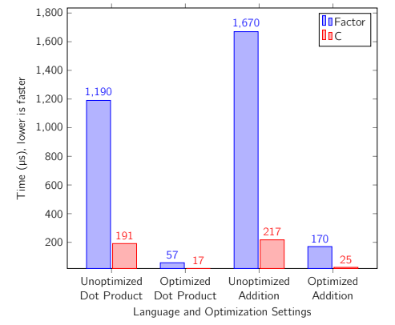
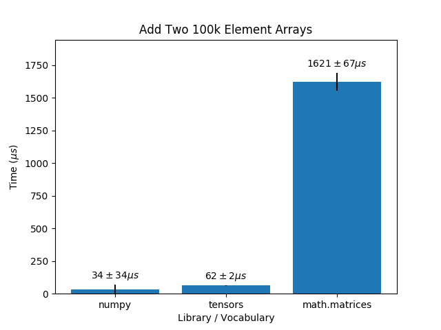
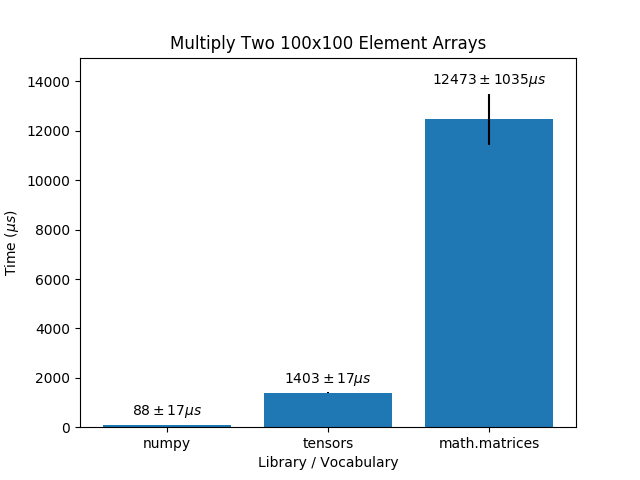
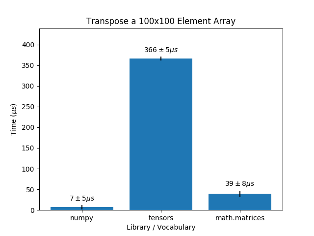

# Numerical Programming

## Motivation

In the past five to ten years, the use of machine learning and, more specifically, neural networks, has rocketed. Many companies and research groups are looking to apply these techniques to their fields. However, these methods often take too long to run, and programmers implementing such algorithms have to ask themselves if machine learning is worth the time both at training and inference time.

To solve this, people create specialized numerical programming libraries, which allow for the manipulation of many numbers at once through the use of matrix operations. Some examples of libraries for numerical programming are [NumPy](https://numpy.org/) and [SciPy](https://www.scipy.org/). Both are incredibly popular and have contributed to Python’s popularity as a language.

The goal of this project was to add in Factor the infrastructure necessary to support numerical programming techniques, including but not limited to shaped arrays and scalable matrix operations. While Factor has the ability to perform fast operations, this is not utilized to perform matrix manipulations. Before this project, there was not a vocabulary that allowed for fast operations on n-dimensional arrays.

## Method

### Existing Matrix Manipulation Vocabularies

The main matrix manipulation vocabulary in Factor called `math.matrices` provides many of the operations required for numerical programming. However, because the matrices manipulated by this vocabulary are Factor `array`s, operations across these matrices can be slow. Additionally, Factor already has a vocabulary called `arrays.shaped` that contains some of the functionality we hoped to achieve. 

However, neither vocabulary incorporates Factor’s static typing or allows for n-dimensional matrices.  Without typed words, operations such as element-wise addition must check the type of each entry in the matrix before performing combining them, leading to a lot of unnecessary work. Because we did not want to overwrite the existing vocabularies, we created a new Factor vocabulary called `tensors` to implement basic shaped arrays functionality.

### Choosing an Implementation Language

We decided to model our approach off of NumPy, given its prominence as a numerical programming library. We had two options for carrying out this project. We could either implement the vocabulary in native Factor or implement it in C and use Factor’s foreign function interface to access the C functions. This is the procedure used by libraries such as NumPy and SciPy. We benchmarked vector operations in Factor against those in C. Unoptimized Factor is much slower than C. However, we found that typed Factor, while still slower, can perform operations faster than unoptimized C code and within an order of magnitude of optimized C.

In order to use Factor’s foreign function interface (FFI), the C code must be compiled into a library file and included with the Factor code. However, different operating systems require different library file formats, so such an implementation would require users to compile C code themselves. Because Factor runs in a virtual machine, neither programmers nor users have to deal with compiling the code to a specific operating system—it’s done automatically. If we implemented our vocabulary in C, it would require a lot of additional work for our vocabulary to be as accessible as the rest of the Factor source code. Additionally, implementing our vocabulary in Factor also allows us to use more high-level language features, such as automatic garbage collection and higher-order functions like map and reduce. We decided that the small performance improvement provided by using C would not be worth the loss of portability or ease of use.

### Optimizing Native Factor

The underlying implementation of the `tensor` class consists of an array that holds the shape, and a float-array that holds the values. Using a typed array increases speed as it avoids type checking at runtime. Similarly, we typed all of our words. This alone allowed for a huge speedup over dynamically typed arrays.

To further optimize, we used SIMD operations, which allowed us to perform vectorized computations. This was used to improve the performance of matrix multiplication.

### Interface

One of our main goals was ease of use. To do this, we tried to make a flexible and simple interface. We used multi-method dispatch when implementing element-wise operations so that they can take either two `tensor`s, or a number and a `tensor` in either order. We also implemented the basic words necessary to apply sequence operations and pretty printing. `tensor`s can also be turned to and from nested arrays using a parsing word.

## Evaluation

In addition to operations over `tensor`s being correct, it was important that they were fast—fast enough that they were useful in situations requiring large matrices. Quantifying this more specifically, our goal was to have all operations run within an order of magnitude of NumPy, the gold standard for numerical programming libraries. We also compared the performance of our vocabulary to the `math.matrices` vocabulary in order to understand what improvements we were actually providing the language.

### Individual Operations

First, we benchmarked three individual operations: element-wise addition, matrix multiplication, and transposition. The performance of the `tensors` vocabulary came within an order of magnitude of NumPy with some operations, but struggled with others. 

Transpose in particular is much slower than both NumPy and `math.matrices`. NumPy has constant-time transposition, so we did not expect to always be within an order of magnitude of their speed. However, we did want our transposition to be faster than `math.matrices`. We believe that the speed of `math.matrices` is due to the fact that the underlying implementation consists of nested arrays rather than a single array, and is therefore easier to map over. Furthermore, `tensor` transposition must be generalizable to any dimension. Still, the current performance is not ideal, and improving the speed of our transposition is an important next step.

### Proof of Concept: Linear Regression

Additionally, as a proof of concept for our vocabulary, we combined a series of operations to perform linear regression on the [Boston housing dataset](https://www.cs.toronto.edu/~delve/data/boston/bostonDetail.html).

<linear regression is not yet implemented for `math.matrices`, but insert graph and analysis here once it is>

## Future Work

Broadly speaking, future work for this vocabulary can be broken up into two major areas: improving `tensor`s’ performance and usability.

There is still room for optimization with the currently implemented words. Many of the implemented words are both more than an order of magnitude slower than NumPy and do not scale as efficiently. In addition, the performance of a number of `sequence` words can be improved by providing `tensor`-specific implementations that take advantage of the underlying structure of the `tensor`. Finally, the `tensors` vocabulary currently only supports 32-bit floats, and allowing `tensor`s to store different types of numbers, including integers and floats of different sizes would allow for additional performance gains where floating point arithmetic is either not necessary or not necessary at that precision.

To improve the usability of the `tensors` vocabulary, there are a number of crucial features implemented with NumPy arrays that the `tensors` vocabulary does not provide. These include broadcasting, performing operations over specific axes, index slicing, and more complicated mathematical operations. The versatility that these operations provide would make using `tensor`s much easier and more frictionless.

Finally, the current vocabulary does not always do a good job of hiding the underlying implementation from the user. Specifically, this becomes a problem when trying to understand error messages. The addition of better error checking—both more specific errors and checking for errors earlier within operations—would make the vocabulary more intuitive and easier to use.
