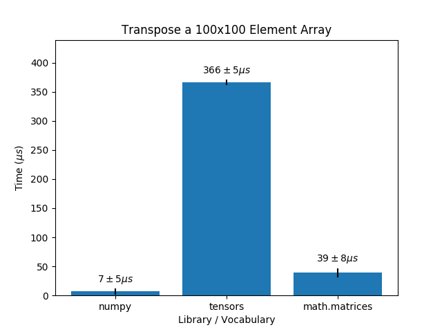

## Evaluation

In addition to operations over `tensor`s being correct, it was
important that they were fast—fast enough that they were useful in
situations requiring large matrices. Quantifying this more
specifically, our goal was to have all operations run within an order
of magnitude of NumPy, the gold standard for numerical programming
libraries. We also compared the performance of our vocabulary to the
`math.matrices` vocabulary in order to understand what improvements we
were actually providing the language.

### Individual Operations

First, we benchmarked three individual operations: element-wise
addition, matrix multiplication, and transposition. The performance of
the `tensors` vocabulary came within an order of magnitude of NumPy
with some operations, but struggled with others.

Transpose in particular is much slower than both NumPy and
`math.matrices`. NumPy has constant-time transposition, so we did not
expect to always be within an order of magnitude of their
speed. However, we did want our transposition to be faster than
`math.matrices`. We believe that the speed of `math.matrices` is due
to the fact that the underlying implementation consists of nested
arrays rather than a single array, and is therefore easier to map
over. Furthermore, `tensor` transposition must be generalizable to any
dimension. Still, the current performance is not ideal, and improving
the speed of our transposition is an important next step.

### Proof of Concept: Linear Regression

Additionally, as a proof of concept for our vocabulary, we combined a
series of operations to perform linear regression on the [Boston
housing
dataset](https://www.cs.toronto.edu/~delve/data/boston/bostonDetail.html).

(linear regression is not yet implemented for `math.matrices`, but
insert graph and analysis here once it is)
